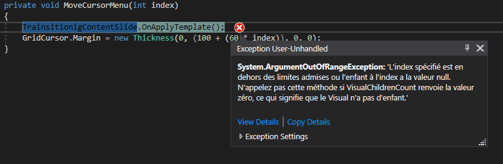

# MaterialDesignThemes

This repository illustrates why MaterialDesignThemes v2.5.0.1205 fails where MaterialDesignThemes v2.3.1.953 works. In this project 
there are 2 commits, both have the same code, the difference is on the version of the MaterialDesignThemes package.

1) The first commit use MaterialDesignThemes v2.3.1.953 => No error
2) The second commit use MaterialDesignThemes v2.5.0.1205 => In error 

The screenshot below displays which instruction generates an error in the second commit.

